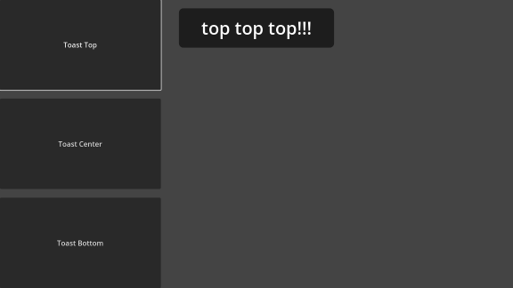
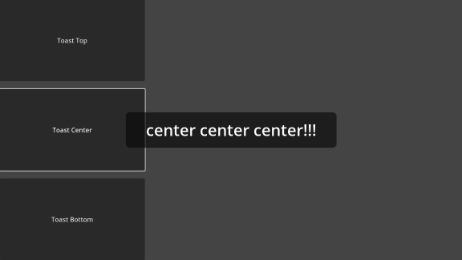
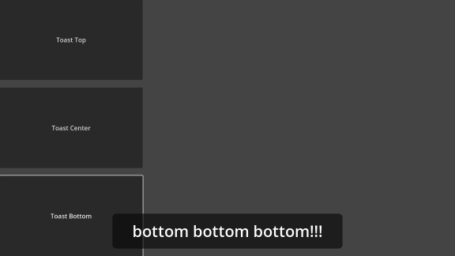

# Godot Toast

## How to use

- Download `Toast.gd` to project
- Add `Toast.gd` to `Autoload`
- Done!

```gdscript
Toast.toast(msg, duration, position)

Toast.toast("top top top!!!", 1, Toast.pos.top)
Toast.toast("center center center!!!", 2, Toast.pos.center)
Toast.toast("bottom bottom bottom!!!", 3, Toast.pos.bottom)
```

## Example

**NOTE: The picture is Godot4.0 Font size use 40**

```gdscript
Toast.toast("top top top!!!", Toast.duration, Toast.pos.top)
```



```gdscript
Toast.toast("top top top!!!", Toast.duration, Toast.pos.center)
```



```gdscript
Toast.toast("top top top!!!", Toast.duration, Toast.pos.bottom)
```


